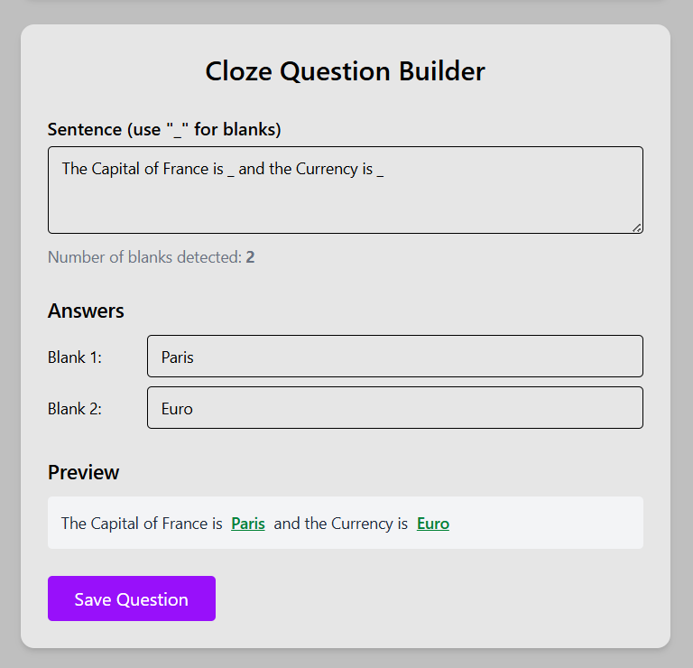
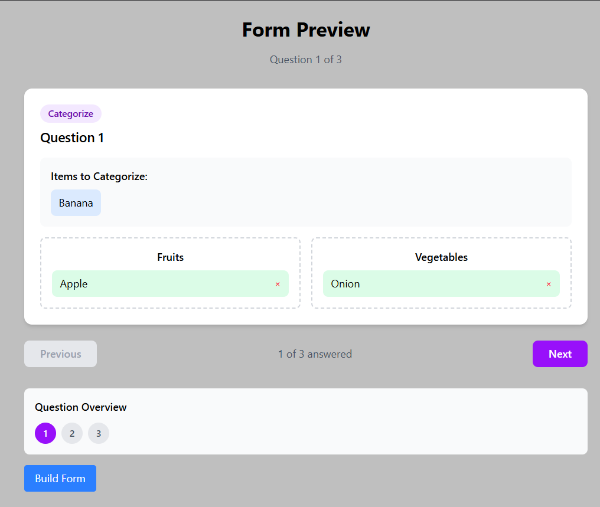
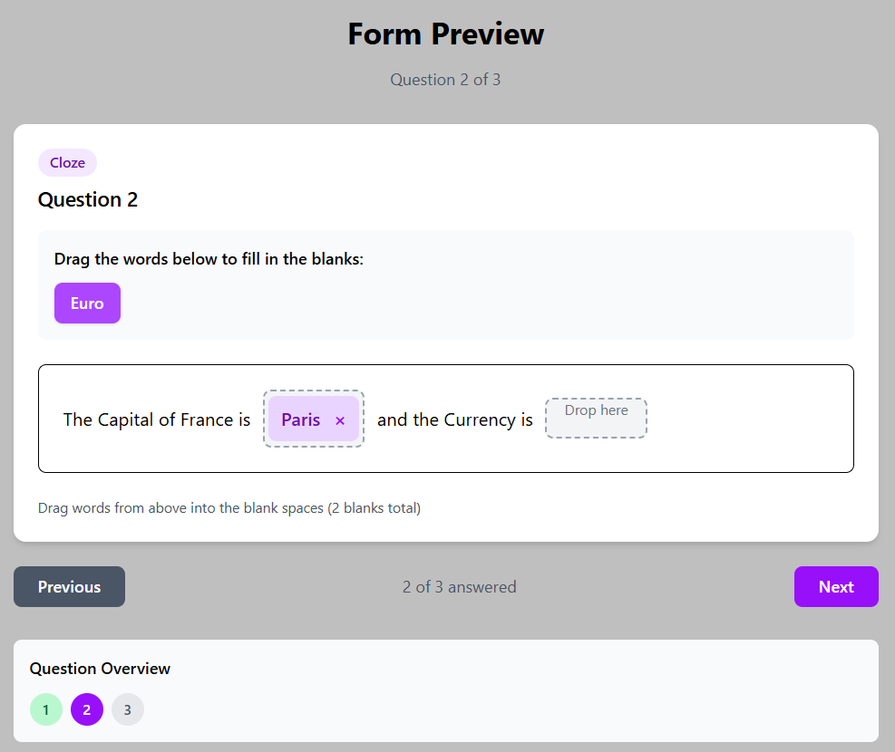

# 📝 Form Builder & Preview App

An interactive **question form builder** with real-time preview capabilities, supporting multiple question types and a smooth user experience.  
Perfect for creating quizzes, comprehension tests, and categorization exercises — then instantly previewing how users will see and interact with them.

---

## ✨ Features

### **1. Question Types**

- 🚀 **Categorize Questions**

  - Create categories and add items.
  - Drag & drop or select from dropdown to assign items to categories.
  - Real-time preview of categorized results.

- ✏️ **Cloze (Fill-in-the-Blank) Questions**

  - Insert sentence with underscores `_` for blanks.
  - Automatically detects the number of blanks.
  - Select dropdowns appear in preview for each blank.

  

    
  

- 📖 **Comprehension Questions**
  - Add a reading passage.
  - Attach multiple-choice questions with selectable answers.

---

### **2. Live Preview**

- See exactly how the final form will look for end-users with `✨Drag and Drop Functionality`

- All question types rendered with a clean **white-themed UI**.
- Fully interactive — test out answers right in the preview.

  
  

---

### **3. Backend API**

- Built with **Express.js** and **MongoDB**.
- REST endpoints for:
  - **Creating questions**
  - **Fetching all questions**
  - **Fetching a single question**
  - **Health check**
- Simple and clean schema: each DB entry stores **one question**.

---

### **4. Practice-Friendly Design**

- Minimal complexity — one question per DB entry makes it easy to store and fetch data.
- Includes an **API endpoint to clear all questions** for quick resets.
- Frontend and backend are loosely coupled — can run backend locally and frontend from deployment.

---

### **5. Technology Stack**

**Frontend:** React, React Router, TailwindCSS, DnD-Kit for drag-and-drop  
**Backend:** Node.js, Express.js, Mongoose, MongoDB  
**Deployment:** Frontend deployable on Vercel or Netlify; backend can run locally

---

## 📌 Example Use Cases

- 🎓 **Educational quizzes** — build and preview questions before sending to students.
- 📝 **Content creation** — quickly design interactive reading comprehension tasks.
- 🎮 **Games & puzzles** — categorize objects, fill in missing words, answer trivia.
